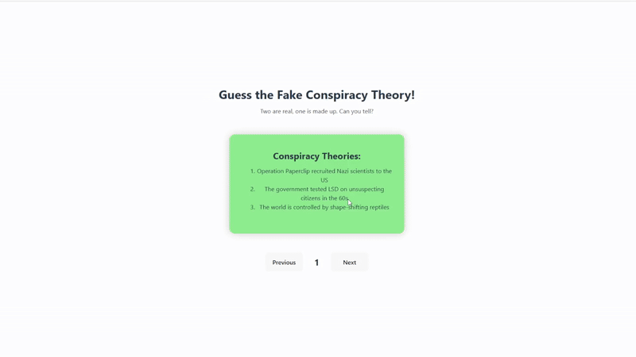

## 🎯 Goals

- [x] Create a new component
- [x] Share a small piece of data from one component to the next
- [x] Utilize useState() to create state variables to help control component behavior
- [x] Use the onClick() event to call a method
- [x] Create multiple div sections to keep track of different chunks of information
- [x] Use those div sections as the basis for CSS styling
- [x] Use useState() to create more state variables of different types
- [x] Use state to change the visual appearance of the web app
- [x] Use state to check that changes to other state are valid
- [x] Use the onClick() and onChange() events to call methods to adjust or reset state variables
- [x] Create space for user input with the input tag
- [x] Create more nested components in order to handle increasing complexity

## ⭐ Required Features

- [x] The title of the card set and some information about it, such as a short description and the total number of cards are displayed
- [x] A single card at a time is displayed, only showing one of the components of the information pair
- [x] Create a list of card pairs (an array of dictionaries where each dictionary contains the question and answer is perfectly fine)
- [x] Clicking on the card shows the corresponding component of the information pair
- [x] Clicking the next button displays a random new card
- [x] The user can enter their guess in a box before seeing the flipside of the card
- [x] Clicking on a submit button shows visual feedback about whether the answer was correct or incorrect
- [x] A back button displayed on the card can be used to return to the previous card in a set sequence
- [x] A next button displayed on the card can be used to navigate to the next card in a set sequence

## 🚀 Stretch Features

- [x] Cards have different visual styles such as color based on their category
- [x] Convert the const cardData into a JSON file
- [ ] A shuffle button can be used to randomize the order of the cards
- [ ] A user's answer may be counted as correct even when it is slightly different from the target answer
- [ ] A counter displays the user’s current and longest streak of correct responses
- [ ] A user can mark a card that they have mastered and have it removed from the pool of answers as well as added to a list of mastered cards

 

GIF created with [Ezgif](https://ezgif.com/)

> [!NOTE]
> Right now, the shuffle button just changes the order of the multiple choice questions - it doesn't actually shuffle the order of the cards (yet).
